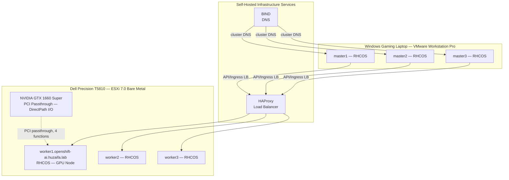
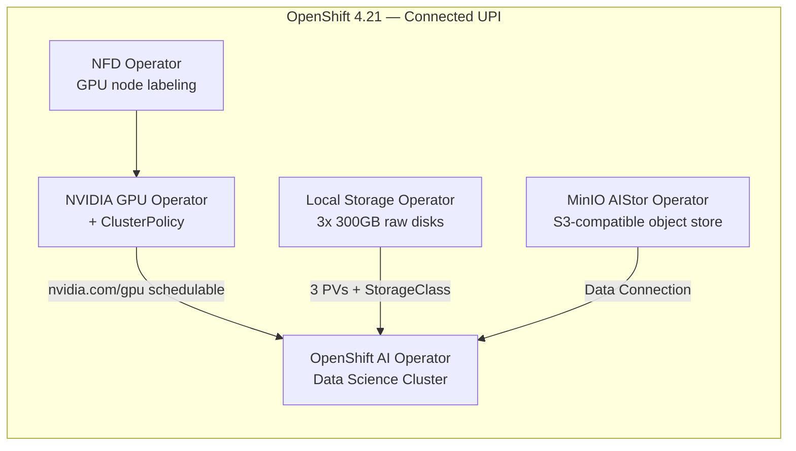

# RHOAI Hybrid GPU Platform Lab

A self-hosted, production-pattern Red Hat OpenShift AI platform built from bare metal — no managed control plane, no cloud GPU credits. This repository documents the architecture, configuration, and verified engineering decisions behind a hybrid-hypervisor OpenShift cluster running GPU-accelerated AI workloads on consumer hardware.

**Status:** Active development. Core platform (cluster, GPU enablement, storage, object store) is deployed and verified. Model serving and agent layer are in progress — see [Roadmap](#roadmap).

---

## Why this exists

Most "I deployed Kubernetes" home lab writeups stop at a working cluster. This one goes further: a connected UPI install mirroring patterns used in regulated/production environments, GPU passthrough on a hybrid hypervisor topology, GPU Operator and RHOAI integration verified end to end via live Prometheus metrics (not just "the pod is Running"), and a documented set of real failures encountered and resolved along the way — not just the happy path.

The goal was to close a specific gap: hands-on, verifiable depth on the AI/ML platform layer of OpenShift, not just core platform administration.

## Architecture





Two deliberate architecture choices worth calling out explicitly, since they're the parts that separate this from a tutorial walkthrough:

**Hybrid hypervisor topology.** Master nodes run nested inside VMware Workstation Pro on a Windows laptop; worker nodes run bare-metal on ESXi on a separate physical workstation. This wasn't the easy path — it was chosen to maximize available compute across mismatched hardware while keeping the GPU-bearing node on bare-metal ESXi where PCI passthrough is actually viable.

**Connected UPI over IPI.** User-provisioned infrastructure with self-hosted HAProxy and BIND, rather than an installer-provisioned cluster. This mirrors the install pattern used in regulated/production environments where infrastructure is managed explicitly rather than abstracted away — at the cost of more manual setup, in exchange for full control over the DNS and load-balancing layer.

## Hardware

| Component | Spec |
|---|---|
| Hypervisor host | Dell Precision T5810 — ESXi 7.0 |
| GPU | NVIDIA GeForce GTX 1660 SUPER (TU116, Turing, 6GB VRAM) |
| Worker nodes | 3x RHCOS VMs on ESXi (worker1 has GPU passthrough) |
| Master nodes | 3x RHCOS VMs, nested on VMware Workstation Pro (Windows laptop) |
| OpenShift version | 4.21 (connected UPI) |
| RHOAI version | 3.4.0 (self-managed) |

## Verified capabilities

Everything below was confirmed via live cluster output during the build, not assumed from documentation. Full command-by-command verification trail is in [`docs/lessons-learned.md`](docs/lessons-learned.md).

- **GPU passthrough** — TU116 GPU passed through from ESXi to a single RHCOS worker via DirectPath I/O, confirmed via `lspci` inside the guest kernel.
- **NVIDIA GPU Operator + driver** — Driver loaded and verified (`nvidia.com/cuda.driver-version.full=580.126.20`), GPU schedulable as `nvidia.com/gpu: 1` allocatable resource.
- **DCGM-based GPU monitoring** — Live utilization metrics confirmed flowing through OpenShift's built-in Prometheus via PromQL (`DCGM_FI_DEV_GPU_UTIL`), correctly attributed to the right node, GPU model, and PCI bus ID.
- **GPU time-slicing** — Single physical GPU exposed as 2 schedulable slices via the NVIDIA device plugin's time-slicing config, verified by confirming two pods can be concurrently `Running` where previously the second would sit `Pending`.
- **Local Storage Operator** — 300GB raw disks across all 3 workers, `LocalVolumeSet` generating 3 dedicated PVs and a StorageClass.
- **OpenShift AI (RHOAI) Data Science Cluster** — Deployed and accessible, Hardware Profile configured to expose the GPU to workbenches and model serving (`gtx1660super-gpu` profile — see [`manifests/hardware-profiles`](manifests/hardware-profiles)).
- **MinIO AIStor** — S3-compatible object storage operator deployed, licensed, console accessible — intended as the data/model artifact backend for RHOAI workloads.

## Repository structure

```
.
├── README.md
├── docs/
│   ├── architecture.md       — extended architecture notes and design rationale
│   └── lessons-learned.md    — real failures encountered and how they were resolved
├── manifests/
│   ├── nfd/                  — Node Feature Discovery instance config
│   ├── gpu-operator/         — ClusterPolicy and GPU time-slicing config
│   └── hardware-profiles/    — RHOAI hardware profile for the GPU node
└── tests/
    └── gpu-sharing-validation.md — before/after test procedure proving time-slicing works
```

## Roadmap

- [x] Hybrid hypervisor cluster (ESXi + nested Workstation Pro), connected UPI
- [x] GPU passthrough, driver, GPU Operator, DCGM monitoring
- [x] Local storage, RHOAI Data Science Cluster, MinIO AIStor
- [x] GPU time-slicing, hardware profile
- [ ] Quantized LLM served via RHOAI model serving (KServe)
- [ ] Domain-specific RAG agent (cluster event/log triage assistant) built on top of the served model
- [ ] CI for manifest validation

## Author

Built and documented by Huzaifa as a hands-on platform engineering project — happy to walk through any part of the design or trade-offs in more depth.
