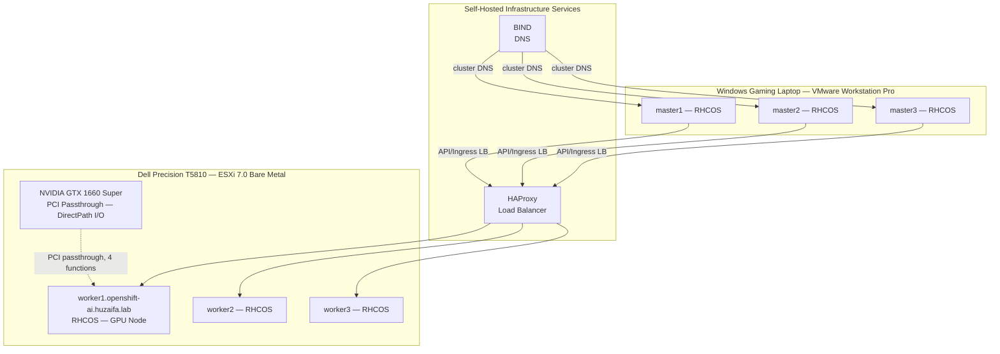
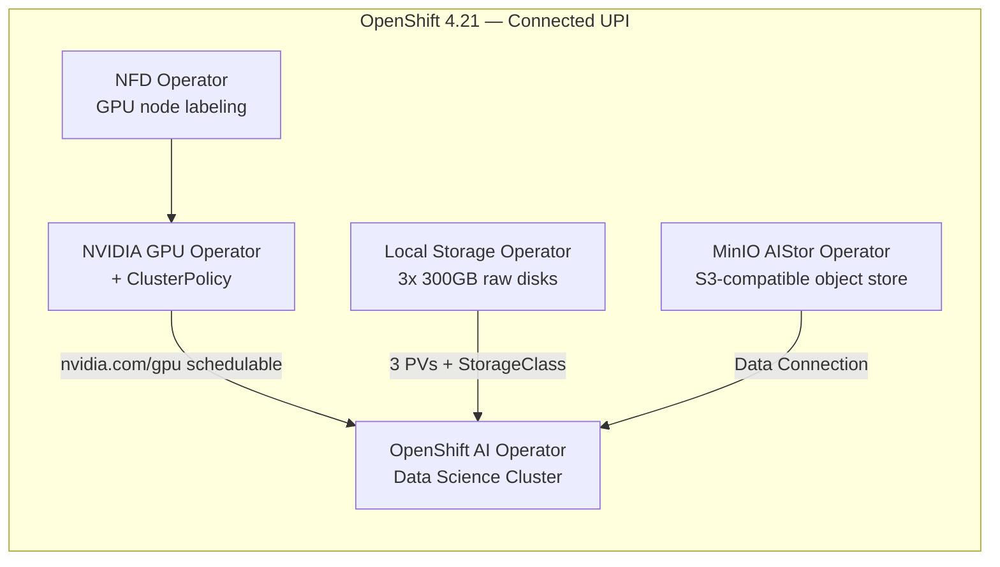

# RHOAI Hybrid GPU Platform Lab

A self-hosted, production-pattern Red Hat OpenShift AI platform built from bare metal — no managed control plane, no cloud GPU credits. This repository documents the architecture, configuration, and verified engineering decisions behind a hybrid-hypervisor OpenShift cluster running GPU-accelerated AI workloads on consumer hardware.

**Status:** Active development. Core platform (cluster, GPU enablement, storage, object store) is deployed and verified. Model serving and agent layer are in progress — see [Roadmap](#roadmap).

---

## Why this exists

Most "I deployed Kubernetes" home lab writeups stop at a working cluster. This one goes further: a connected UPI install mirroring patterns used in regulated/production environments, GPU passthrough on a hybrid hypervisor topology, GPU Operator and RHOAI integration verified end to end via live Prometheus metrics (not just "the pod is Running"), and a documented set of real failures encountered and resolved along the way — not just the happy path.

The goal was to close a specific gap: hands-on, verifiable depth on the AI/ML platform layer of OpenShift, not just core platform administration.

## Architecture





Two deliberate architecture choices worth calling out explicitly, since they're the parts that separate this from a tutorial walkthrough:

**Hybrid hypervisor topology.** Master nodes run nested inside VMware Workstation Pro on a Windows laptop; worker nodes run bare-metal on ESXi on a separate physical workstation. This wasn't the easy path — it was chosen to maximize available compute across mismatched hardware while keeping the GPU-bearing node on bare-metal ESXi where PCI passthrough is actually viable.

**Connected UPI over IPI.** User-provisioned infrastructure with self-hosted HAProxy and BIND, rather than an installer-provisioned cluster. This mirrors the install pattern used in regulated/production environments where infrastructure is managed explicitly rather than abstracted away — at the cost of more manual setup, in exchange for full control over the DNS and load-balancing layer.

## Hardware

| Component | Spec |
|---|---|
| Hypervisor host | Dell Precision T5810 — ESXi 7.0 |
| GPU | NVIDIA GeForce GTX 1660 SUPER (TU116, Turing, 6GB VRAM) |
| Worker nodes | 3x RHCOS VMs on ESXi (worker1 has GPU passthrough) |
| Master nodes | 3x RHCOS VMs, nested on VMware Workstation Pro (Windows laptop) |
| OpenShift version | 4.21 (connected UPI) |
| RHOAI version | 3.4.0 (self-managed) |

## Verified capabilities

Everything below was confirmed via live cluster output during the build, not assumed from documentation. Full command-by-command verification trail is in [`docs/lessons-learned.md`](docs/lessons-learned.md).

- **GPU passthrough** — TU116 GPU passed through from ESXi to a single RHCOS worker via DirectPath I/O, confirmed via `lspci` inside the guest kernel.
- **NVIDIA GPU Operator + driver** — Driver loaded and verified (`nvidia.com/cuda.driver-version.full=580.126.20`), GPU schedulable as `nvidia.com/gpu: 1` allocatable resource.
- **DCGM-based GPU monitoring** — Live utilization metrics confirmed flowing through OpenShift's built-in Prometheus via PromQL (`DCGM_FI_DEV_GPU_UTIL`), correctly attributed to the right node, GPU model, and PCI bus ID.
- **GPU time-slicing** — Single physical GPU exposed as 2 schedulable slices via the NVIDIA device plugin's time-slicing config, verified by confirming two pods can be concurrently `Running` where previously the second would sit `Pending`.
- **Local Storage Operator** — 300GB raw disks across all 3 workers, `LocalVolumeSet` generating 3 dedicated PVs and a StorageClass.
- **OpenShift AI (RHOAI) Data Science Cluster** — Deployed and accessible, Hardware Profile configured to expose the GPU to workbenches and model serving (`gtx1660super-gpu` profile — see [`manifests/hardware-profiles`](manifests/hardware-profiles)).
- **MinIO AIStor** — S3-compatible object storage operator deployed, licensed, console accessible — intended as the data/model artifact backend for RHOAI workloads.

## Repository structure

```
.
├── README.md
├── docs/
│   ├── architecture.md       — extended architecture notes and design rationale
│   └── lessons-learned.md    — real failures encountered and how they were resolved
├── manifests/
│   ├── nfd/                  — Node Feature Discovery instance config
│   ├── gpu-operator/         — ClusterPolicy and GPU time-slicing config
│   └── hardware-profiles/    — RHOAI hardware profile for the GPU node
└── tests/
    └── gpu-sharing-validation.md — before/after test procedure proving time-slicing works
```

## Roadmap

- [x] Hybrid hypervisor cluster (ESXi + nested Workstation Pro), connected UPI
- [x] GPU passthrough, driver, GPU Operator, DCGM monitoring
- [x] Local storage, RHOAI Data Science Cluster, MinIO AIStor
- [x] GPU time-slicing, hardware profile
- [ ] Quantized LLM served via RHOAI model serving (KServe)
- [ ] Domain-specific RAG agent (cluster event/log triage assistant) built on top of the served model
- [ ] CI for manifest validation

## Author

Built and documented by Huzaifa as a hands-on platform engineering project — happy to walk through any part of the design or trade-offs in more depth.


# Lessons Learned

This is a record of the actual problems hit during this build, what caused them, and how they were resolved — not a cleaned-up happy path. Each one cost real debugging time; documenting them is meant to save that time for the next person, and to demonstrate the troubleshooting process itself, which is a large part of what platform engineering actually is.

## 1. PCI passthrough conflicts with nested hardware-assisted virtualization

**Symptom:** ESXi refused to add the GPU as a PCI device to the worker VM: `PCI passthrough devices cannot be added when Nested Hardware-Assisted Virtualization is enabled.`

**Cause:** VMware does not allow PCI passthrough and nested virtualization (exposing VT-x/AMD-V to the guest) on the same VM simultaneously — both require conflicting control over EPT/IOMMU memory management.

**Fix:** Power off the VM, disable "Expose hardware-assisted virtualization to the guest OS" under CPU settings, then retry the passthrough configuration. Nested virt exposure is only needed if a node will run OpenShift Virtualization/KubeVirt workloads — not relevant for a plain container worker.

## 2. PCI passthrough requires full memory reservation

**Symptom:** VM failed to power on: `Invalid memory setting: memory reservation (sched.mem.min) should be equal to memsize.`

**Cause:** Passthrough devices can DMA directly into guest memory, which means the hypervisor cannot swap or balloon that memory — it must be fully pinned.

**Fix:** Edit Settings → Memory tab → enable "Reserve all guest memory (All locked)."

## 3. NVIDIA's consumer driver refuses to load inside a VM

**Cause:** NVIDIA's consumer (GeForce) driver checks for a hypervisor signature and declines to initialize if it detects it's running inside a VM — a deliberate vendor restriction, not a bug.

**Fix:** Add `hypervisor.cpuid.v0 = "FALSE"` to the VM's `.vmx` configuration (via Edit Settings → VM Options → Advanced → Edit Configuration, or directly in the `.vmx` file over SSH) to spoof bare metal before the OS boots and the driver loads.

## 4. RHCOS is immutable — there is no manual driver install

**Mistake avoided:** The instinct on a normal Linux box is to SSH in and run NVIDIA's `.run` installer. On RHCOS (the OS OpenShift workers run), this doesn't work — the filesystem is managed by the Machine Config Operator and any manual changes get reverted on the next sync.

**Correct approach:** The NVIDIA GPU Operator's driver DaemonSet builds and loads a kernel module matched exactly to the running RHCOS kernel version, inside a privileged container. That's the only supported mechanism for getting a GPU driver onto an immutable node. Verification at the hardware level before the driver exists should use `lspci`, not `nvidia-smi` — the latter only becomes meaningful once the GPU Operator's driver pod is `Running`.

## 5. RHOAI documentation version drift: Accelerator profiles vs Hardware profiles

**Symptom:** Following Red Hat's official "Enabling accelerators" documentation (RHOAI 2.16), the referenced `Settings → Accelerator profiles` menu item and `AcceleratorProfile` CRD did not exist anywhere in the cluster.

**Cause:** The documentation consulted was for RHOAI 2.16. The actual deployed version was RHOAI 3.4.0. Starting in RHOAI 2.19, "Accelerator profiles" was deprecated and fully replaced by "Hardware profiles" — a different CRD (`hardwareprofiles.infrastructure.opendatahub.io`), a different menu location (`Settings → Environment setup → Hardware profiles`), and a different configuration workflow entirely.

**Fix:** Always confirm the exact installed operator version before following version-specific procedures:
```
oc get csv -n redhat-ods-operator
```
A documented upgrade-path step (deleting a `migration-gpu-status` ConfigMap) was also evaluated and correctly ruled out — that step only applies to clusters upgrading from an older accelerator-profile-based install, not a fresh 3.x deployment, where the ConfigMap never existed in the first place.

## 6. CUDA MPS does not currently work correctly on OpenShift

**Finding, not yet hit as a live failure:** Before configuring CUDA MPS as a GPU-sharing strategy, research surfaced a documented, currently-open issue specific to OpenShift: MPS test pods report success, but only one process actually executes on the GPU at a time — Red Hat and NVIDIA engineers have an open item to fix this. This is distinct from generic Kubernetes, where MPS does work as documented.

**Decision:** Time-slicing was used instead, both because it's confirmed working on this platform and because it more honestly represents the tradeoffs being made — no memory isolation, shared fault domain, but functional. The lesson here is procedural: confirm a platform-specific known-issue list before investing setup time in a feature, rather than discovering it mid-implementation.

## 7. Hardware profile resource limits should reflect real node capacity, not template defaults

**Observation:** RHOAI's default hardware profile ships with conservative CPU/memory ceilings (4 cores / 8GiB) inherited as a starting template. For a GPU-dedicated profile on a node with significantly more headroom (7.5 cores / 29.2GiB allocatable on `worker1`), leaving these at template defaults would have under-provisioned every workload using the profile by default. Limits were recalculated against actual `oc describe node` allocatable values, leaving a deliberate margin for the GPU Operator's own DaemonSet pods running on the same node.

## General principle that held throughout this build

Several of the issues above came from applying documentation, configuration, or prior assumptions without first verifying them against the actual running cluster — a CRD name, a config field, a procedure intended for a different version or scenario. The consistent fix in every case was the same: check the live cluster state directly (`oc get crd`, `oc get csv`, `oc describe node`) before acting on an assumption, however confident-sounding the source.
